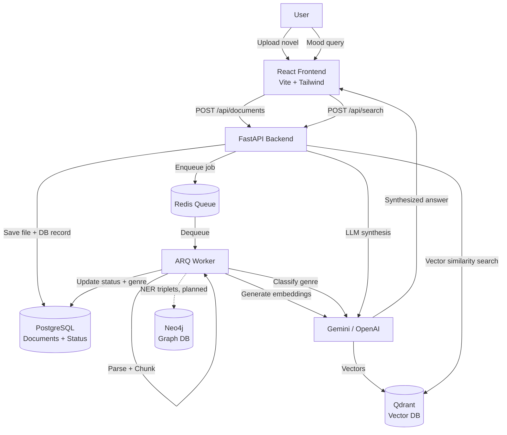
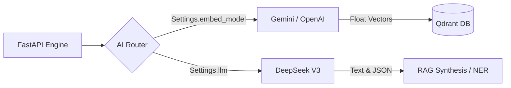
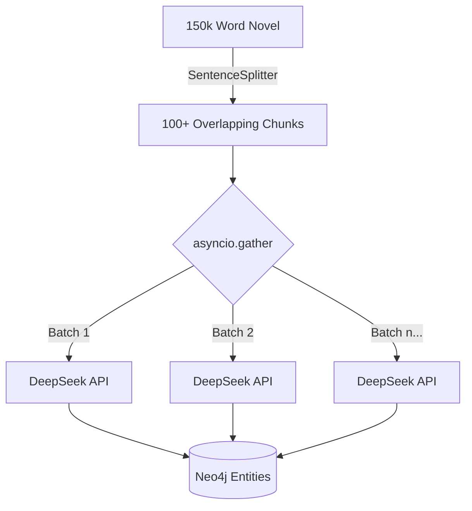
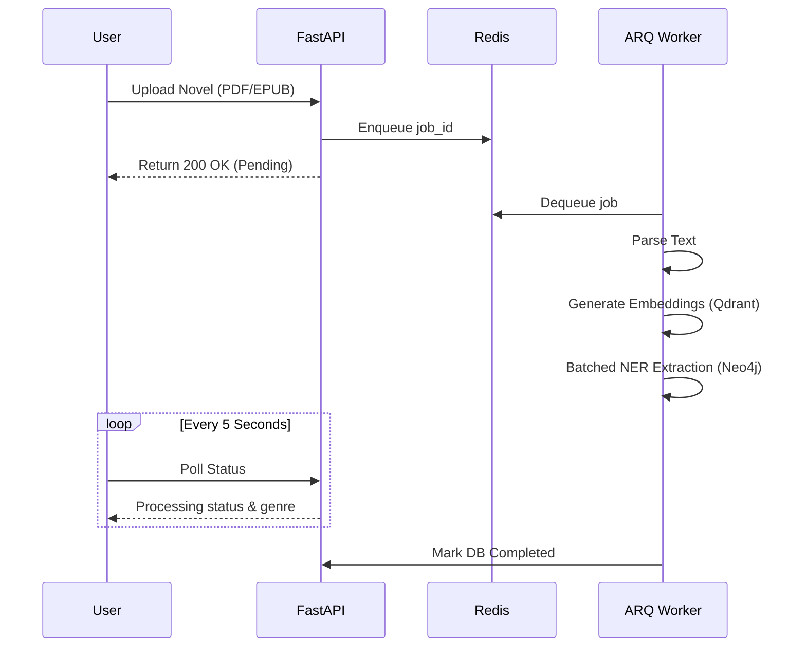

<div align="center">

# 🎧 Moodbound

**An AI-powered reading companion that understands the *mood* of your novels.**

[](https://python.org)
[](https://fastapi.tiangolo.com)
[](https://react.dev)
[](https://ai.google.dev)
[](https://platform.openai.com)
[](https://deepseek.com)
[](https://docker.com)

> *"Find me a scene with a melancholic, rainy-day vibe."* — this app actually answers that.

</div>

---

## 🎯 What is this?

Moodbound is a full-stack AI application that goes far beyond a traditional search engine. Instead of matching keywords, it understands the **semantic meaning, mood, and emotional context** of your novel collection using vector embeddings and Retrieval-Augmented Generation (RAG).

Upload a novel. Ask about a vibe. Get back the exact scene, excerpt, and AI-synthesized explanation — with source attribution.

---

## ✅ Features

| Feature | Status | Description |
|---|---|---|
| 📤 **Document Upload** | ✅ Complete | Drag-and-drop upload for PDF, EPUB, and TXT |
| 🧠 **Vibe Search** | ✅ Complete | Semantic RAG search powered by Gemini / OpenAI |
| 🔄 **Async Ingestion Pipeline** | ✅ Complete | Background ARQ workers handle heavy embedding work |
| ✂️ **Narrative Chunking** | ✅ Complete | Splits text by paragraph/scene boundaries, not blind tokens |
| 🗂️ **AI Auto-Categorization** | ✅ Complete | LLM classifies genre automatically on ingest |
| 📚 **Library Management** | ✅ Complete | View/delete books with real-time processing status |
| 🔌 **Decoupled AI Providers** | ✅ Complete | Mix/match LLMs and Embeddings (`deepseek` + `gemini`) |
| 🌐 **Knowledge Graph** | ✅ Complete | Neo4j character relationship graph with d3-force clustering |
| ♻️ **Cascading DB Deletes** | ✅ Complete | Deleting a novel cleans Postgres, Qdrant, and Neo4j |
| 🎨 **Vibe-Reactive UI** | 🔜 Planned | Theme transitions based on the mood of search results |
| 🔍 **Hybrid Search (RRF)** | 🔜 Planned | Combine dense vectors + BM25 sparse search |

---

## 🏛️ Architecture



---

## 🛠️ Tech Stack

| Layer | Technology | Purpose |
|---|---|---|
| **Frontend** | React 19 + Vite + TypeScript | SPA with glassmorphic UI |
| **Styling** | Tailwind CSS | Dynamic, vibe-reactive styling |
| **Backend** | Python + FastAPI | REST API & orchestration |
| **AI Orchestration** | LlamaIndex | RAG pipeline, query engine |
| **LLM / Embeddings** | DeepSeek / OpenAI / Gemini | Synthesis, embeddings, NER extraction |
| **Vector DB** | Qdrant | Semantic similarity search |
| **Graph DB** | Neo4j | Character relationship storage (planned) |
| **SQL DB** | PostgreSQL | Document metadata & status |
| **Task Queue** | Redis + ARQ | Async background workers |
| **Infrastructure** | Docker Compose | One-command dev environment |

---

## 🚀 Getting Started

### Prerequisites
- Docker & Docker Compose
- Python 3.11+
- Node.js 20+
- A [DeepSeek API key](https://platform.deepseek.com/api_keys), [OpenAI API key](https://platform.openai.com/api-keys), or [Google AI API key](https://ai.google.dev)

### 1. Clone and configure

```bash
git clone https://github.com/your-username/moodbound.git
cd moodbound
cp .env.example .env
# Edit .env and add your API key
```

### 2. Start the database stack

```bash
docker compose up -d
```

### 3. Start the backend

```bash
cd backend
pip install -r requirements.txt

# Terminal 1: API server
python -m uvicorn app.main:app --reload

# Terminal 2: Background worker
python -m arq app.worker.WorkerSettings
```

### 4. Start the frontend

```bash
cd frontend
npm install
npm run dev
```

Open [http://localhost:5173](http://localhost:5173) 🎉

---

## ⚙️ Configuration (`.env`)

Duplicate the `.env.example` file to create your local `.env` variable map.

```bash
cp .env.example .env
```

By decoupling the AI syntax via the config template, developers can mix and match providers natively — pairing DeepSeek's incredibly low-cost, high-speed API for generation with OpenAI/Gemini's highly granular embedding models.

---

## 🔬 Engineering Highlights

### Narrative Chunking
Most RAG systems split text at fixed token counts, which breaks mid-sentence and destroys context. This system chunks by **paragraph and scene boundaries**, preserving the semantic coherence of each passage before embedding it.

### Agentic LLM Router
Queries are intercepted by a router prompt before retrieval. The LLM decides whether to consult the **Vector DB** (vibe/mood searches) or the **Graph DB** (character relationship queries). This is the foundation for true GraphRAG.

### AI Auto-Categorization
After every document is ingested and vectorized, the LLM reads the first chunk and classifies the genre using a constrained prompt — zero user effort, near-zero token cost.

### Decoupled AI Architecture
RAG models historically tie embeddings and synthesis to the same provider. We decoupled this: you can explicitly define `provider/model` mappings in your `.env`. This allows us to use **DeepSeek V3** exclusively for narrative intelligence and NER relationship generation (which requires heavy token output for cheap), while using **OpenAI embeddings** for precision Qdrant indexing.

### Hybrid Search (Reciprocal Rank Fusion)
To solve the hallucination problem inherent in dense vector "vibe matching", Moodbound natively blends **BM25 Sparse Keyword** searches alongside its Qdrant dense embeddings. When a novel is ingested, both indices are built in parallel using `fastembed`. During retrieval, LlamaIndex mathematically merges both results with an `alpha=0.5` weighting, guaranteeing that exact-character nouns bubble to the absolute top of the results while preserving semantic meaning.

### Canvas WebGL Knowledge Graph
Extracting the Neo4j relationships is only half the battle. Visualizing 500+ nodes in the DOM natively crashes Chrome. We bypassed the DOM entirely and migrated the `/graph/:documentId` UI to a pure **HTML5 Canvas WebGL** engine using `react-force-graph-2d`. We intercept the draw loop to natively render Obsidian-style glowing character connections while pushing all `d3-force` layout physics to a background Web Worker to preserve a locked 60 FPS UI thread.



### Concurrent Batched NER Extraction
Extracting a Neo4j knowledge graph from a 150,000-word novel in one shot would fail every LLM's context window. Instead, Moodbound slices the novel into overlapping sequential blocks, dispatches 10 parallel asynchronous routines with `asyncio.gather()`, and concurrently extracts relationships to dramatically reduce wait times from hours to roughly 35 seconds.



### Async Ingestion Pipeline
File upload returns instantly. Heavy work (PDF parsing, LLM embedding calls, batched graph extraction) is dispatched to Redis-backed ARQ workers. The frontend polls for status updates every 5 seconds, showing live `Loading → Parsing → Classifying → Extracting → Completed` UI transitions.



---

## 🗺️ Roadmap

- [x] **Hybrid Search (Reciprocal Rank Fusion)** — combined dense + sparse BM25 retrieval
- [ ] **Vibe-Reactive UI** — color palette and animations shift to match the emotional tone of results
- [ ] **GraphRAG Queries** — route relationship questions to Neo4j instead of Qdrant
- [ ] **Streaming Chat Responses** — Stream text blocks live to UI to hide API latency

---

## 📄 License

MIT — use freely, attribution appreciated.
