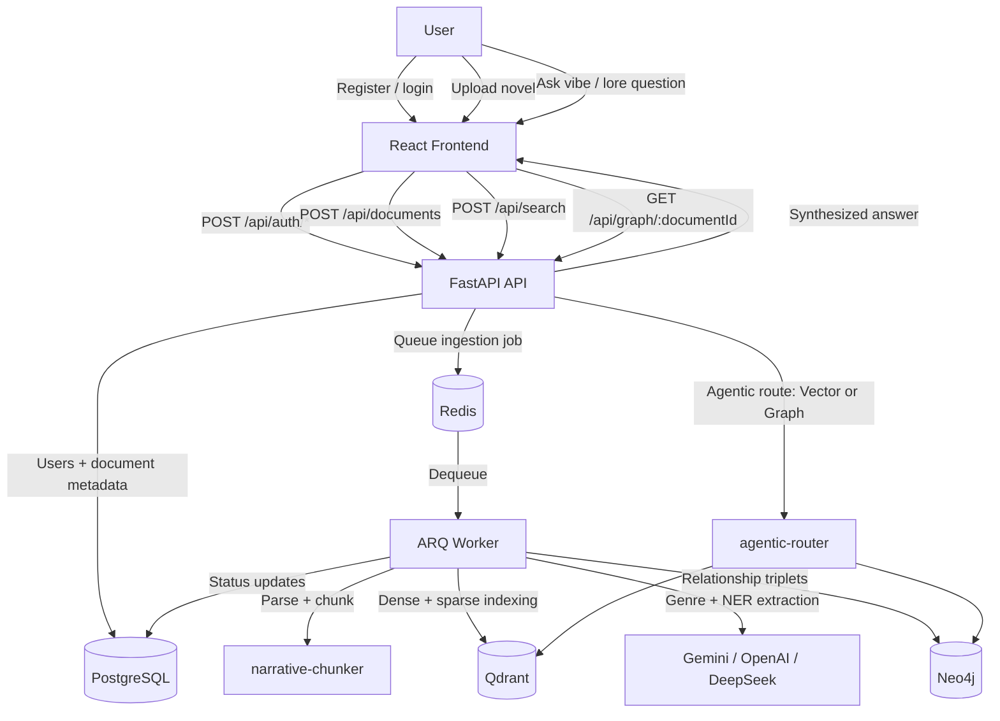

<div align="center">

# 🎧 Moodbound

**An AI-powered reading companion that understands the mood of your novels.**

[](https://python.org)
[](https://fastapi.tiangolo.com)
[](https://react.dev)
[](https://www.npmjs.com/package/vibe-particles)
[](https://pypi.org/project/agentic-router/)
[](https://pypi.org/project/narrative-chunker/)
[](https://docker.com)

> *"Find me a scene with a melancholic, rainy-day vibe."*

</div>

---

## What Is This?

Moodbound is a full-stack AI app for a private novel library. It supports authenticated uploads, asynchronous ingestion, hybrid semantic search, and a document-level character graph built from extracted relationship triplets.

The core app is working end to end. It is not fully production-hardened yet, and this README reflects the current checked-in state rather than the aspirational roadmap.

---

## Current State

| Area | Status | Notes |
|---|---|---|
| 📤 **Document Upload** | Shipped | Drag-and-drop upload for PDF, EPUB, and TXT |
| 🧠 **Vibe Search** | Shipped | Hybrid semantic search with synthesized answers and source excerpts |
| 🔄 **Async Ingestion Pipeline** | Shipped | FastAPI hands work to Redis + ARQ workers |
| ✂️ **Narrative Chunking** | Shipped | Uses `narrative-chunker` with semantic splitting and sentence fallback |
| 🗂️ **AI Auto-Categorization** | Shipped | Genre classification runs during ingestion |
| 👤 **Auth & Profiles** | Shipped | JWT auth, profile editing, and local avatar uploads |
| 📚 **Library Management** | Shipped | Listing, status polling, and delete cleanup across SQL, Qdrant, Neo4j, and local files |
| 🌐 **Knowledge Graph** | Beta | Neo4j-backed extraction, graph view, and graph-routed answers are wired up |
| 🔌 **Decoupled AI Providers** | Shipped | Provider/model strings can split embeddings and LLM generation |
| 🎨 **Vibe-Reactive UI** | Shipped | Search results drive color theme and particle preset changes |
| 🔍 **Hybrid Search (RRF)** | Shipped | Qdrant hybrid retrieval with dense + sparse search |
| 📦 **Package Extraction** | Shipped | `vibe-particles`, `agentic-router`, and `narrative-chunker` are separate packages |

### Known Gaps

- There is no end-to-end smoke or integration suite yet; the current safety net is strong unit/component coverage plus CI gates.
- Service bootstrap paths like `app.main` and `app.worker` are not deeply tested; they are still validated through local startup and workflow runs.
- Profile avatars are still stored on the local filesystem rather than an object store.

---

## Architecture



---

## Extracted Packages

This app now depends on three extracted packages:

- `vibe-particles` (npm): the background particle engine used by the frontend
- `agentic-router` (PyPI): zero-shot routing and classification helpers
- `narrative-chunker` (PyPI): document parsing and metadata-aware chunk orchestration

---

## Tech Stack

| Layer | Technology | Purpose |
|---|---|---|
| **Frontend** | React 19 + Vite + TypeScript | SPA UI |
| **Styling** | Tailwind CSS | Glassmorphic, vibe-reactive styling |
| **Visual Effects** | [`vibe-particles`](https://www.npmjs.com/package/vibe-particles) | Canvas 2D particle engine |
| **Graph UI** | `react-force-graph-2d` | Canvas graph rendering for character relationships |
| **Backend** | Python + FastAPI | REST API and orchestration |
| **AI Orchestration** | [`agentic-router`](https://pypi.org/project/agentic-router/) | Route selection and zero-shot classification |
| **Text Processing** | [`narrative-chunker`](https://pypi.org/project/narrative-chunker/) | File parsing and chunk orchestration |
| **Core RAG Framework** | LlamaIndex | Query engine and vector-store integration |
| **LLM / Embeddings** | Gemini / OpenAI / DeepSeek | Embeddings, synthesis, classification, NER |
| **Vector DB** | Qdrant | Hybrid retrieval |
| **Graph DB** | Neo4j | Character relationship storage and graph answers |
| **SQL DB** | PostgreSQL | Users, documents, status, profile data |
| **Task Queue** | Redis + ARQ | Background ingestion jobs |
| **Infrastructure** | Docker Compose | Local dev services |

---

## Getting Started

### Prerequisites

- Docker Desktop / Docker Compose
- Python 3.11+
- Node.js 20+
- Provider API keys for the models you plan to use

### 1. Clone and configure

```bash
git clone <your-repo-url> light-vibe-novels
cd light-vibe-novels
cp .env.example .env
```

### 2. Start infrastructure

```bash
docker compose up -d
```

### 3. Quick start on Windows

The repo includes PowerShell launchers that start Docker, prompt for provider keys, and open terminals for the frontend, API, and worker:

```powershell
powershell -ExecutionPolicy Bypass -File .\scripts\start-dev.ps1
```

Note: the current scripts prompt for `GOOGLE_API_KEY`, `OPENAI_API_KEY`, and `DEEPSEEK_API_KEY` before launch.

### 4. Manual backend startup

```bash
cd backend
pip install -r requirements.txt
python -m fastembed download
```

Then run the API and worker in separate terminals:

```bash
# terminal 1
cd backend
python -m uvicorn app.main:app --reload
```

```bash
# terminal 2
cd backend
python -m arq app.worker.WorkerSettings
```

### 5. Manual frontend startup

```bash
cd frontend
npm install
npm run dev
```

Open [http://localhost:5173](http://localhost:5173).

### 6. Smoke test

Unauthenticated health check:

```bash
curl http://localhost:8000/api/system/status
```

Authenticated routes such as `/api/search/`, `/api/documents/`, `/api/graph/{document_id}`, and `/api/auth/me` require a bearer token.

---

## Configuration

The root `.env.example` contains the current local-development shape:

- `AI_PROVIDER`: global fallback provider
- `EMBEDDING_MODEL`: optional `provider/model` override for embeddings
- `FAST_LLM_MODEL`: optional `provider/model` override for LLM generation
- `GOOGLE_API_KEY`
- `OPENAI_API_KEY`
- `DEEPSEEK_API_KEY`
- `POSTGRES_*`, `NEO4J_*`

For non-local environments, set a real `JWT_SECRET_KEY` explicitly instead of relying on the development fallback in code.

Example provider split:

```env
AI_PROVIDER=gemini
EMBEDDING_MODEL=openai/text-embedding-3-small
FAST_LLM_MODEL=deepseek/deepseek-chat
```

---

## Testing And Quality Gates

### Frontend

```bash
cd frontend
npm run verify
```

This runs lint, coverage, and production build checks. The coverage report is written to `frontend/coverage/`.

### Backend

```powershell
pwsh -File .\scripts\test-backend.ps1
pwsh -File .\scripts\test-backend-coverage.ps1
```

The coverage script enforces the backend threshold from `.coveragerc` and writes the HTML report to `backend/coverage/`.

### Git Hooks

Install local hooks once per clone:

```bash
pre-commit install --hook-type pre-commit --hook-type pre-push
```

Current local gates:

- `pre-commit`: frontend coverage + backend coverage
- `pre-push`: frontend verify + backend coverage

### CI

GitHub Actions runs the same quality checks for repository changes:

- `.github/workflows/frontend-quality.yml`
- `.github/workflows/backend-quality.yml`

---

## Engineering Notes

### Narrative Chunking

The ingestion pipeline prefers LlamaIndex's `SemanticSplitterNodeParser` and falls back to `SentenceSplitter` if semantic pre-processing fails. `narrative-chunker` handles file loading and metadata injection onto the produced nodes.

### Agentic Routing

Search requests are routed between the vector path and the graph path using `agentic-router`. The same package is also used for vibe classification and genre classification prompts.

### Hybrid Search

The vector path uses Qdrant hybrid retrieval through LlamaIndex with `vector_store_query_mode="hybrid"` and `alpha=0.5`. The current implementation also applies a `user_id` metadata filter on the vector search path.

### Relationship Extraction

During ingestion, the worker samples chunks across the document, batches them, and runs bounded concurrent extraction calls before writing relationship triplets into Neo4j.

### Graph Visualization

The graph page uses `react-force-graph-2d` with custom Canvas drawing for nodes and links. It polls for updates every 5 seconds while the document is still being processed.

---

## Roadmap

- Done: hybrid dense + sparse retrieval
- Done: vibe-reactive UI and extracted `vibe-particles` engine
- Done: extracted `agentic-router` and `narrative-chunker` packages
- In progress: multi-tenancy and security hardening
- Next: Qdrant cleanup on document delete
- Next: semantic caching and streaming responses
- Next: observability, query rewriting, and reranking

---

## License

MIT
